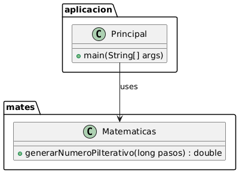

# Aplicación de Aproximación de Pi

Este proyecto contiene una aplicación Java que calcula una aproximación del número Pi utilizando el método de Montecarlo.

## Estructura del Proyecto

El proyecto está dividido en dos paquetes principales:

1. `aplicacion`: Contiene la clase principal que maneja la entrada del usuario y muestra el resultado.
2. `mates`: Contiene la clase `Matematicas` que realiza el cálculo de Pi.

## Clases

### Principal

La clase `Principal` se encuentra en el paquete `aplicacion` y es responsable de:

- Solicitar al usuario el número de dardos lanzados.
- Llamar al método `generarNumeroPiIterativo` de la clase `Matematicas` para calcular Pi.
- Mostrar el resultado al usuario.

### Matematicas
La clase Matematicas se encuentra en el paquete mates y es responsable de:

- Calcular una aproximación del número Pi utilizando el método de Montecarlo.

### Diagrama UML

## Cómo Ejecutar
1. Compila las clases Java:

javac aplicacion/Principal.java mates/Matematicas.java

2. Ejecuta la aplicación:

java aplicacion.Principal

## Descripción del Método de Montecarlo
El método de Montecarlo es una técnica de simulación que utiliza números aleatorios para aproximar resultados matemáticos. En este caso, se utiliza para calcular el valor de Pi generando puntos aleatorios dentro de un cuadrado y contando cuántos caen dentro de un círculo inscrito.

## Autor
Luis Holgado Arranz y Juan Manuel Mbela Ela